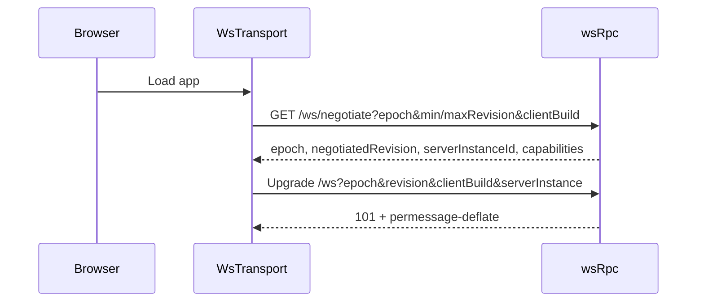

# Transport

How the browser and server talk: connect negotiation, WebSocket compression, and static asset delivery.

Synara's transport was originally built for localhost, where bandwidth is free and latency is negligible. The mechanisms below exist because neither holds over a real network — they are also what makes running a session against a remote host practical.

## Connect negotiation

Connecting is a **single handshake**. The browser first asks `/ws/negotiate` (HTTP) what the server speaks, then opens the feature socket at `/ws` carrying the negotiated answer as query parameters.

`/ws/negotiate` returns the protocol epoch, the negotiated revision, the server's **instance id**, and the capability list. The socket request must echo all of it back.

`validateWsFeatureCompatibility` ([`wsCompatibility.ts`][2]) rejects a mismatch with **HTTP 426** and a typed reason:

| Condition                            | Reason                    | Client action |
| ------------------------------------ | ------------------------- | ------------- |
| Epoch differs, or parameters missing | `WS_NEGOTIATION_REQUIRED` | reload        |
| Revision below the server's minimum  | —                         | update client |
| Revision above the server's maximum  | —                         | update server |
| `serverInstanceId` does not match    | `WS_NEGOTIATION_REQUIRED` | reload        |

The instance id is a fresh UUID per server boot. That is what makes a restart mid-negotiation detectable: a client holding credentials from a previous server generation is told to reload rather than silently talking a stale protocol against a new process. A 426 on `/ws` is therefore **expected behaviour** for any client that has not negotiated — not a fault.

## WebSocket compression

`permessage-deflate` is negotiated on the feature socket with **context takeover**, so each frame is compressed against the window left by previous frames. Orchestration traffic is highly repetitive JSON — the same envelope keys with a few fields changed — so the repeated structure costs almost nothing after the first message. Measured against representative orchestration frames, this is roughly a 79% reduction.

Two safety properties matter more than the ratio:

- **`maxPayload` is enforced on the decompressed size.** Compression cannot be used to smuggle an oversized frame past the limit.
- **Compression is negotiated only on the feature socket path.** The dispatch in [`nodeHttpServer.ts`][1] fails closed: a socket on any other path gets no compression rather than silently inheriting it. `upgradePathAllowsCompression` is the single point that decides this.

## Static assets

The build emits `.br` and `.gz` sidecars next to each asset. [`staticAssets.ts`][3] serves the best encoding the client actually accepts, falling back to identity.

| Encoding | Full bundle | Reduction |
| -------- | ----------- | --------- |
| identity | 18.09 MB    | —         |
| gzip     | 4.44 MB     | 75.4%     |
| brotli   | 3.63 MB     | 79.9%     |

Details that are easy to get wrong and are therefore tested:

- **`Accept-Encoding` parsing ranks `identity` among the codings** rather than special-casing it, so `identity;q=0` and `br;q=0` both behave per RFC 9110. An encoding explicitly refused with `q=0` is never served.
- **Conditional requests** use weak comparison for `If-None-Match`, and the ETag varies by encoding — a brotli response and an identity response of the same file are different entities.
- **Cache lifetime follows content addressing.** Hashed assets are `public, max-age=31536000, immutable`; `index.html` is `no-cache`. Caching the entry document would pin a browser to a stale bundle, so it is deliberately excluded.

## Thread subscription and cursor resume

Subscribing to a thread can **resume from a cursor** instead of refetching full history ([`threadDetailResumeCursors.ts`][4]).

Resume is fenced by a high-water mark. The server trusts a cursor only when the subject thread still exists, the gap to the journal head is non-negative (hard purges can lower the head below a cursor a client legitimately held), and the gap fits the replay limit. Any other cursor falls back to the full-snapshot path **inside the same stream** — the client is served a snapshot as if it had never sent a cursor, with no extra round trip. (`ORCHESTRATION_RESNAPSHOT_REQUIRED` is the snapshot path's own fence for a replay that can no longer cover its gap; the resume shortcut never emits it.) The fence is deliberately conservative: a redundant snapshot is wasteful, a stale delta is wrong, so any doubt resolves toward the snapshot.

The `afterSequence` field is optional on the subscribe input, so an older client simply never sends it and receives full snapshots exactly as before.

Cursor state also gates sidebar prewarming: a speculative prewarm subscription is only cheap when it can resume from a cursor, so threads without cached detail are not prewarmed from scroll position and pay their first full snapshot when actually opened. That trades a slightly colder first open of a never-viewed thread for not spending the per-client thread-stream budget on full-history streams the user may never look at.

[1]: ../apps/server/src/nodeHttpServer.ts
[2]: ../apps/server/src/wsCompatibility.ts
[3]: ../apps/server/src/staticAssets.ts
[4]: ../apps/web/src/threadDetailResumeCursors.ts
