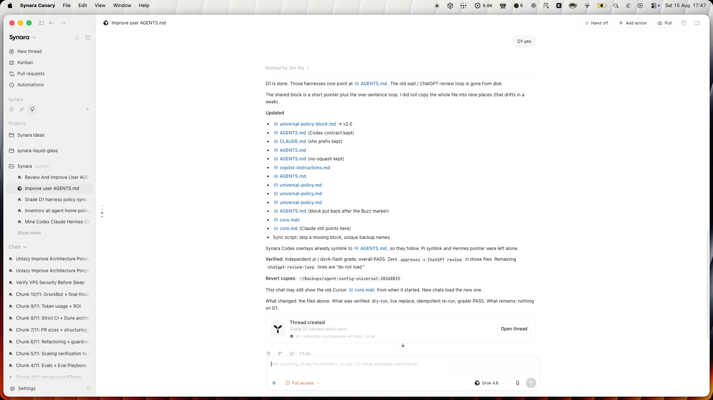

# Synara

Synara is a free, open-source, local-first desktop workspace and control plane for coding agents.

It brings provider sessions, tasks, terminals, browser work, diffs, Git worktrees, handoffs,
automations, and pull-request delivery into one application. Synara uses the agent subscriptions
and accounts you already have, keeps your workspace data on your machine, and does not require a
separate Synara cloud.



## What it does

- **Multi-provider workspace** — Claude Code, Codex, OpenCode, Cursor, Antigravity, Grok Build, Kilo Code, Pi, and Factory Droid from one app, with the subscriptions you already use.
- **Parallel agents** — run tasks in isolated Git worktrees with their own branches so concurrent agents stay out of each other's way. Watch native subagents and workflows with live phases and pause/stop controls.
- **One working surface** — keep split chats, real terminals, browser previews and verification, files, diffs, and Git tools beside the conversation.
- **Handoffs and orchestration** — hand a task to a different provider so the new model continues with the same context and environment, or schedule recurring agent runs with automations.
- **Agent Gateway and External MCP** — let a supported provider session inside the app create and steer other Synara tasks, or pair local MCP clients such as Codex and Claude Code with a scoped, revocable integration.
- **Plan and Debug modes** — the agent can propose before executing and pause to ask questions, or run any provider through an evidence-first debug loop without changing runtime permissions.
- **Persistent thread goals** — attach an explicit multi-turn objective with pause/resume, achievement history, and bounded autonomous continuation.
- **Review and delivery** — inspect diffs, run browser verification, commit, push, open pull requests, and use the pull-request workspace to review, comment, and merge without leaving the app.
- **Local-first by design** — chats, projects, and history stay on your machine. Coding-agent traffic goes directly to the provider you pick rather than through a Synara model service.

## Providers

Synara connects to the coding-agent runtimes installed and authenticated on your machine. The
provider still owns its account, models, tools, permissions, and service; Synara owns the durable
task, working environment, transcript, and review surfaces around that session.

| Provider                                                                | What Synara connects to                                      |
| ----------------------------------------------------------------------- | ------------------------------------------------------------ |
| [Claude Code](https://www.trysynara.com/docs/providers/claude-code)     | Your installed Claude Code runtime and authenticated account |
| [Codex](https://www.trysynara.com/docs/providers/codex)                 | Your installed and authenticated Codex CLI                   |
| [OpenCode](https://www.trysynara.com/docs/providers/opencode)           | Your local OpenCode runtime and configured model providers   |
| [Cursor](https://www.trysynara.com/docs/providers/cursor)               | Your local Cursor agent runtime and account                  |
| [Antigravity](https://www.trysynara.com/docs/providers/antigravity)     | Your installed and authenticated Antigravity CLI             |
| [Grok Build](https://www.trysynara.com/docs/providers/grok)             | Your configured Grok Build runtime and access                |
| [Kilo Code](https://www.trysynara.com/docs/providers/kilo-code)         | Your Kilo Code runtime and configured credentials            |
| [Pi](https://www.trysynara.com/docs/providers/pi)                       | Pi and the model providers configured through it             |
| [Factory Droid](https://www.trysynara.com/docs/providers/factory-droid) | Your installed and authenticated Droid runtime               |

## Install

Install the [desktop app from the Releases page](https://github.com/Emanuele-web04/synara/releases),
or download it from [trysynara.com](https://www.trysynara.com/).

Synara does not include a model subscription. Install and authenticate at least one supported
provider — such as Claude Code, Codex, OpenCode, or Cursor — before starting your first task.
Provider authentication, API keys, model access, and usage limits remain with the provider.

You can also run Synara locally from source while the project is still early:

```sh
bun install
bun run dev
```

## Documentation

The full product documentation lives at [trysynara.com/docs](https://www.trysynara.com/docs).
A few focused guides are also kept in this repository:

- [Quickstart](docs/quickstart.md) — from installation to your first reviewed change in about five minutes.
- [Core concepts](docs/core-concepts.md) — projects, tasks, environments, provider sessions, and Git ownership.
- [Providers](docs/providers.md) — what Synara manages and what stays provider-owned.
- [External MCP integrations](docs/external-mcp.md) — pair another local app with a scoped Synara task surface.

## Privacy

Synara runs as the workspace layer on your machine. There is no Synara cloud holding your
repositories, chats, or project history.

The provider you choose still receives the prompts, file snippets, diffs, terminal output, or tool
results needed for a session, but that traffic goes to the provider you picked rather than through a
separate Synara-hosted workspace.

## Status

Synara is still very early. Expect bugs, rough edges, and fast-moving internals.

Focused issues and PRs are welcome, especially bug fixes, reliability fixes, and small maintenance
improvements.

## Contributing

Read [CONTRIBUTING.md](./CONTRIBUTING.md) before opening an issue or PR.

Need support? [Open a GitHub issue](https://github.com/Emanuele-web04/synara/issues).

## Origins

Synara began as a clone of [T3Code](https://github.com/pingdotgg/t3code), but it has since become a substantially different product with its own branding, packaging, release system, provider orchestration, desktop app behavior, and product direction.
