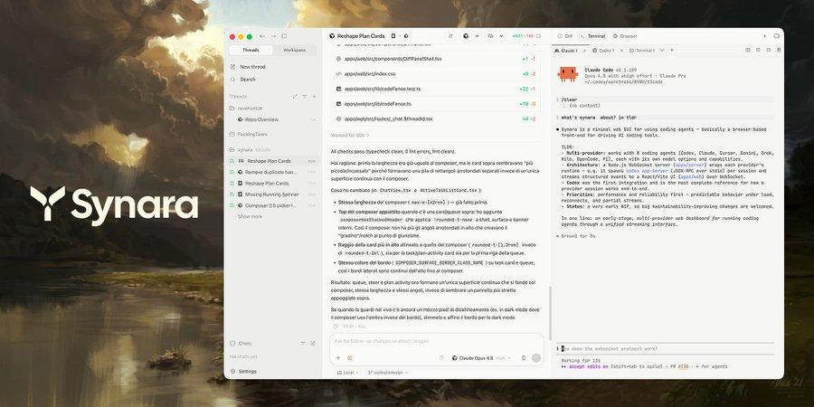

# Forkara

Forkara is a free, open-source, local-first desktop workspace and control plane for coding agents.

It brings provider sessions, tasks, terminals, browser work, diffs, Git worktrees, handoffs,
automations, and pull-request delivery into one application. Forkara uses the agent subscriptions
and accounts you already have, keeps workspace data on your machine, and does not require a
separate Forkara cloud.

Forkara is early-stage software. APIs and interface details remain under active development.



## Capabilities

### Projects, threads, and context

Organize work around projects and threads. Projects define the workspace; threads preserve the
task-specific conversation, state, files, and history.

- **Multi-provider workspace** — Claude Code, Codex, OpenCode, Cursor, Antigravity, Grok Build,
  Kilo Code, Pi, and Factory Droid from one app, with the subscriptions you already use.
- **Parallel agents** — run tasks in isolated Git worktrees with their own branches so concurrent
  agents stay out of each other's way. Watch native subagents and workflows with live phases and
  pause/stop controls.
- **Plan and Debug modes** — the agent can propose before executing and pause to ask questions, or
  run any provider through an evidence-first debug loop without changing runtime permissions.
- **Persistent thread goals** — attach an explicit multi-turn objective with pause/resume,
  achievement history, and bounded autonomous continuation.

### Integrated workspace tools

Keep the active conversation alongside the surface it is changing:

| Surface            | Purpose                                                                                       |
| ------------------ | --------------------------------------------------------------------------------------------- |
| **Changes**        | Inspect diffs, changed files, and review state.                                               |
| **Terminal**       | Run commands in the project environment.                                                      |
| **Browser**        | Keep local previews, browser work, and the floating in-chat browser panel next to the thread. |
| **Files / Editor** | Browse, inspect, and edit project files in context.                                           |
| **Git**            | Work with branches, commits, pushes, and pull requests.                                       |

Split views, browser previews, and device previews keep execution and verification connected to the
task that produced them.

### Handoffs, delivery, and external MCP

Forkara is an MCP-native agent harness in two directions: supported agents running inside Forkara
automatically receive tools to coordinate Forkara tasks and automations, while Codex, Claude, and
other local MCP clients can connect through a scoped integration to launch and follow Forkara work.

- **Handoffs and orchestration** — continue a task with another provider while keeping its project
  context, or schedule recurring agent runs with automations.
- **Review and delivery** — inspect diffs, run browser verification, commit, push, open pull
  requests, and use the pull-request workspace to review, comment, and merge without leaving the app.
- **External MCP** — pair local MCP clients through a scoped, revocable integration. See
  [External MCP integrations](docs/external-mcp.md) for setup and permission boundaries.

## Installation

Download the desktop app from [Forkara Releases](https://github.com/redxzeta/forkara/releases), or
run it locally from source:

```console
git clone https://github.com/redxzeta/forkara.git
cd forkara
bun install
bun run dev
```

Forkara does not include a model subscription. Install and authenticate at least one supported
provider — such as Claude Code, Codex, OpenCode, or Cursor — before starting a session. Provider
authentication, API keys, model access, and usage limits remain with the provider.

## Documentation

Focused guides in this repository include:

- [Quickstart](docs/quickstart.md)
- [Core concepts](docs/core-concepts.md)
- [Providers](docs/providers.md)
- [External MCP integrations](docs/external-mcp.md)
- [X integration](docs/x-integration.md)

## Privacy

Forkara runs as the workspace layer on your machine. There is no Forkara cloud holding your
repositories, chats, or project history. Provider traffic goes directly to the provider you pick.

## Contributing

Bug fixes, reliability improvements, performance work, documentation, and maintenance changes are
welcome. Read [CONTRIBUTING.md](./CONTRIBUTING.md) before opening a pull request, or
[open an issue](https://github.com/redxzeta/forkara/issues) for a reproducible problem.

## Origins

Forkara began as a clone of [T3Code](https://github.com/pingdotgg/t3code), but it has since become a substantially different product with its own branding, packaging, release system, provider orchestration, desktop app behavior, and product direction.

## License

Forkara is licensed under the [MIT License](./LICENSE).
